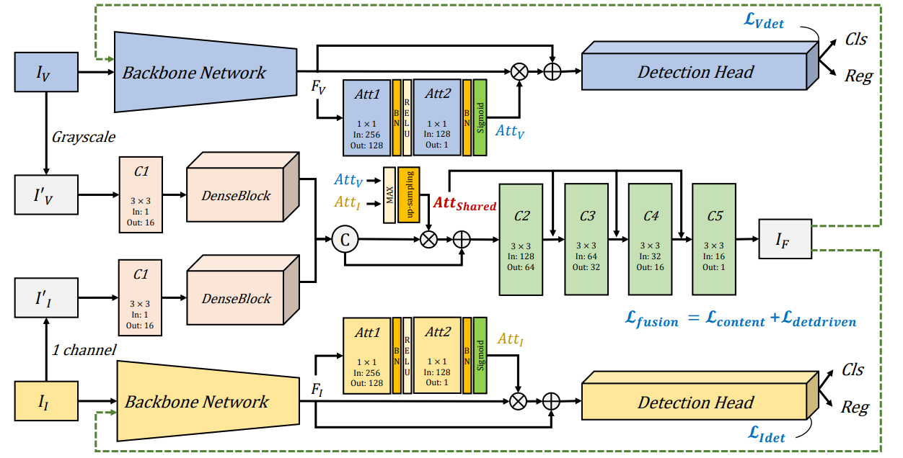

# DetFusion

This is the official repository for "DetFusion: A Detection-driven Infrared and Visible Image Fusion Network" (ACM MM 2022). The repo is based on [mmdetection](https://github.com/open-mmlab/mmdetection). This paper can be downloaded in the [link](https://dl.acm.org/doi/abs/10.1145/3503161.3547902).

## Introduction

Infrared and visible image fusion aims to utilize the complementary information between the two modalities to synthesize a new image containing richer information. Most existing works have focused on how to better fuse the pixel-level details from both modalities in terms of contrast and texture, yet ignoring the fact that the significance of image fusion is to better serve downstream tasks. For object detection tasks, object-related information in images is often more valuable than focusing on the pixel-level details of images alone. To fill this gap, we propose a detection-driven infrared and visible image fusion network, termed DetFusion, which utilizes object-related information learned in the object detection networks to guide multimodal image fusion. We cascade the image fusion network with the detection networks of both modalities and use the detection loss of the fused images to provide guidance on task-related information for the optimization of the image fusion network. Considering that the object locations provide a priori information for image fusion, we propose an object-aware content loss that motivates the fusion model to better learn the pixel-level information in infrared and visible images. Moreover, we design a shared attention module to motivate the fusion network to learn object-specific information from the object detection networks. Extensive experiments show that our DetFusion outperforms state-of-the-art methods in maintaining pixel intensity distribution and preserving texture details. More notably, the performance comparison with state-of-the-art image fusion methods in task-driven evaluation also demonstrates the superiority of the proposed method.



## Installation

Please refer to [INSTALL.md](INSTALL.md) for installation.

## Getting Started

### Inference with trained models

You can use the following commands to get the fused images.

```shell
python tools/test.py
```

### Train a model

You can use the following commands to train the DetFusion.

```shell
python tools/train.py configs/DetFusion.py
```

### Model 

BaiduYun download link can be found [here](https://pan.baidu.com/s/1Ai_7dzT9rY4gJ3rWstE3ug?pwd=xg1g) with extracting code **xg1g**.

## Citation

```
@inproceedings{sun2022detfusion,
  title={Detfusion: A detection-driven infrared and visible image fusion network},
  author={Sun, Yiming and Cao, Bing and Zhu, Pengfei and Hu, Qinghua},
  booktitle={Proceedings of the 30th ACM International Conference on Multimedia},
  pages={4003--4011},
  year={2022}
}
```
